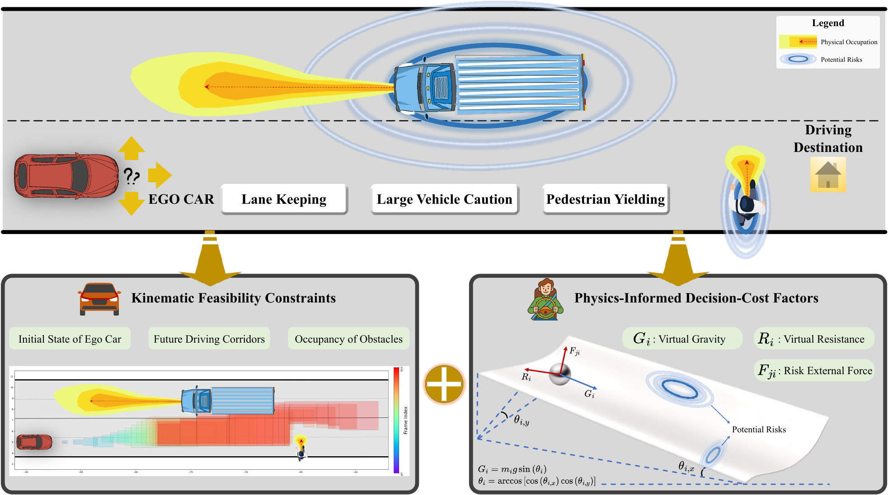

# Interaction Complexity

Public implementation for the paper:

> **Interaction Complexity in Autonomous Driving: A Feasibility and Decision-Cost Quantification Framework**

[](https://www.python.org/)
[](LICENSE)
[](https://commonroad.in.tum.de/)

This repository computes interaction complexity (IC) for driving scenarios in
the CommonRoad XML format. The paper primarily evaluates SIND left-turn
scenarios converted into this format. IC measures scenario difficulty from two
complementary perspectives:

- **IC-Area**: interaction-induced contraction of the reachable driving corridor;
- **IC-Action**: additional least-action decision cost relative to a counterfactual
  no-interaction baseline;
- **IC-Combined**: robust normalized fusion of the area and action components.

The release focuses on the IC computation and paper-table reproduction pipeline.
Large datasets, planner outputs, and private experiment logs are not included.

## Overview

<p align="center">
  
</p>

<p align="center">
  <em>Concept framework of interaction complexity. The metric combines feasible-space contraction with a physics-informed least-action decision-cost proxy.</em>
</p>

For each scenario, the pipeline constructs an actual multi-agent case and a
counterfactual no-dynamic-obstacle case. It then compares their reachable
corridors and least-action fields to obtain a scene-level complexity score.

## Repository Layout

```text
interaction-complexity/
├── configs/                  # paper configuration and normalized-fusion stats
├── docs/                     # method, data, and reproduction notes
├── examples/                 # small CommonRoad XML examples
├── scenario_lists/           # example scenario lists
├── scripts/                  # command-line entry points
├── src/interaction_complexity/
│   ├── engine.py             # public single-scenario IC API
│   ├── evaluation/           # normalized fusion and table utilities
│   └── legacy/               # reachable-set + least-action core
├── tests/
├── README.md
├── LICENSE
├── pyproject.toml
└── environment.yml
```

## Installation

Create the conda environment and install the package in editable mode:

```bash
conda env create -f environment.yml
conda activate interaction-complexity
pip install -e .
```

The implementation depends on the CommonRoad ecosystem, especially
`commonroad-io`, `commonroad-reach`, and `commonroad-drivability-checker`.
If your platform requires custom CommonRoad installation steps, install those
packages first and then run `pip install -e .`.

## Quick Start

Run IC on one example scenario:

```bash
python scripts/run_ic_single.py \
  --scenario examples/CHN_SIND-834_10834_LEFT_T-10935.xml \
  --config configs/ic_v5_alpha1.json \
  --fusion-config configs/normalized_fusion.yaml \
  --output-dir outputs/ic_single/CHN_SIND-834_10834_LEFT_T-10935 \
  --no-vis
```

The output directory contains:

```text
scene_complexity.pkl
scene_complexity.json
action_field_diagnostics.json
path_conflict_diagnostics.json
metadata.json
```

The concise JSON summary reports the main scores:

```json
{
  "ic_area": "...",
  "ic_action": "...",
  "ic_combined_raw_0p5": "...",
  "ic_combined_normalized_w_area_0p7": "...",
  "action_field_component_scaled": true
}
```

`ic_combined_normalized_w_area_0p7` is the paper-style normalized IC score for
the area-dominant sensitivity setting (`w_area=0.7`, `w_action=0.3`).

## Batch Usage

Create a scenario-list file with one XML path or scenario id per line. For the
included examples:

```bash
python scripts/run_ic_batch.py \
  --scenario-list scenario_lists/example_scenarios.txt \
  --config configs/ic_v5_alpha1.json \
  --fusion-config configs/normalized_fusion.yaml \
  --output-dir outputs/ic_example_batch \
  --workers 3
```

If a scenario id rather than a path is used, the script resolves it under
`data/sind_left_turn/<scenario_id>.xml`. For public use, explicit XML paths are
recommended.

## Data Access

This repository includes several example CommonRoad XML scenarios under
`examples/` for quick testing. The full SIND left-turn XML scenario set used in
the paper is available upon reasonable request. Please contact
`chen_kun@tongji.edu.cn` for access.

## Paper Configuration

The released configuration `configs/ic_v5_alpha1.json` corresponds to the
paper revision setting:

- full-horizon evaluation (`n_step = frame_out - frame_in`);
- component-scaled least-action field;
- reference-path temporal-conflict potential inside the social-interaction term;
- incremental Gaussian-process field reconstruction;
- incremental physical dynamic-programming path selection;
- robust normalized area/action fusion.

The normalized fusion statistics are stored in
`configs/normalized_fusion.yaml`. They are estimated from the training split and
kept fixed during evaluation.

See [docs/method_overview.md](docs/method_overview.md) for the implementation
details and the mapping between code outputs and paper notation.

## Reproducing Paper-Style Tables

The paper evaluates IC against fixed planner-failure labels. This repository
does not ship planner outputs, but it provides the scripts used to reproduce
the table statistics once scores and labels are available.

1. Run `scripts/run_ic_batch.py` on your scenario set.
2. Prepare a labels CSV with columns:

```text
scenario_id,rl_fail,cr_fail,cs_fail
```

3. Reproduce Table I/II-style statistics:

```bash
python scripts/reproduce_table1_table2.py \
  --scores outputs/ic_example_batch/normalized_fusion/scores_and_labels.csv \
  --labels path/to/planner_labels.csv \
  --output-dir outputs/table_reproduction
```

See [docs/reproduce_paper_results.md](docs/reproduce_paper_results.md) for
details.

## Citation

If you use this code, please cite the associated paper. A BibTeX entry will be
added after publication.

## License

This project is released under the MIT License. See [LICENSE](LICENSE).
